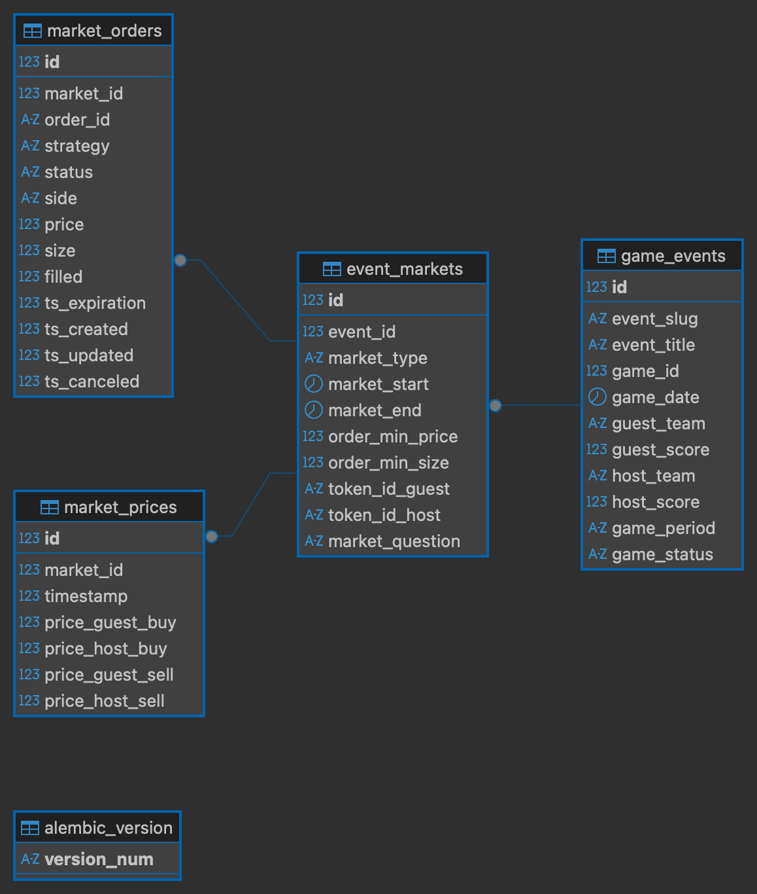

This service collects Polymarket NBA-related event data (games, markets, and price history) via API, processes it, and stores it in a database. The service can be adapted for processing game events from other sports leagues (e.g. WNBA, NHL, NFL).

## Schema



## Usage

The system is built around a RabbitMQ-based task processing model. A consumer subscribes to task queues, executes incoming tasks, and publishes results back to response queues.

Start RabbitMQ consumer:

```bash
python -m main
```

(Optional) Run manual database update

```bash
python -m src.service.etl.update
```
